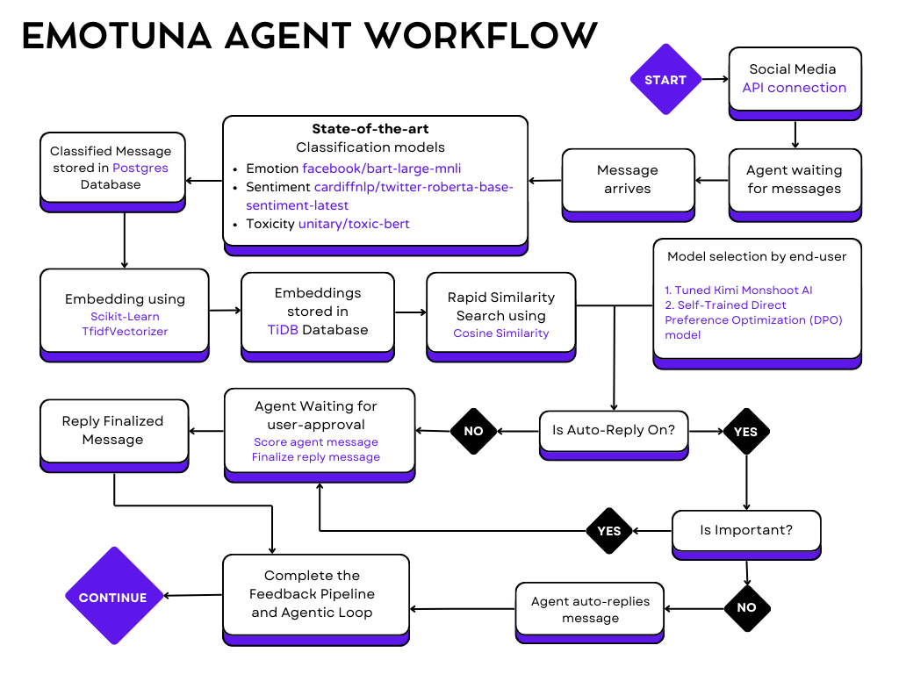

# Emotuna

Emotuna is a privacy-first, agentic AI chat system that learns your unique texting style, slang, tone, emojis, and auto-replies across major social media platforms (Telegram, YouTube, Facebook, WhatsApp, Discord, Twitter, etc.). Designed for per-user personalization, robust feedback, and seamless integration, Emotuna securely stores all data in a database and features a fully automated, cloud-ready agentic pipeline.

---


## Features

- **Per-User Personalization:** Each user has a dedicated agent that learns and mimics their texting style, slang, and emoji usage.
- **Privacy-First:** All chat and model data is securely managed in the database, ensuring strict per-user isolation and eliminating any possibility of cross-user data exposure.
- **Social Media Userbot Integration:** Connect your accounts on Telegram, YouTube, Facebook, WhatsApp, Discord, Twitter, etc., and let Emotuna auto-reply on your behalf.
- **Emotion & Sentiment Awareness:** Messages are classified for emotion, sentiment, and toxicity using state-of-the-art models.
- **Auto-Reply & Approval Workflow:** Enable auto-reply for routine messages; important messages always require manual approval.
- **Feedback Loop:** Every message and reply is classified, embedded, and used to continually improve the agent’s style.
- **DPO Model Training:** Train your own Direct Preference Optimization (DPO) model for personalized reply generation using your chat feedback and preferences.
- **Dataset & Model Management:** Upload/download your chat dataset and fine-tuned models via API endpoints.
- **Cloud-Ready:** Minimal dependencies, fast deployment, and scalable architecture.

---


## Architecture Overview

- **Frontend:** React + Vite
- **Backend:** Django + Django REST Framework (DRF)
- **Database:** PostgreSQL (chat/model data), TiDB (embeddings, fast similarity search)
- **AI Models:**
	- Sentiment: `cardiffnlp/twitter-roberta-base-sentiment-latest`
	- Toxicity: `unitary/toxic-bert`
	- Classification: `facebook/bart-large-mnli`
	- Embedding: `TfidfVectorizer` (per-user)
	- Reply Generation: Kimi API (Moonshot AI)
- **Social Media Integration:** Per-user userbot sessions for Telegram, YouTube, Facebook, WhatsApp, Discord, Twitter, etc.
- **Deployment:** Railway (Backend), GitHub Pages (Frontend)

---


## Data Flow & Agentic Pipeline

1. **Message Ingestion:**
	- Incoming messages are stored in the `ChatMessage` model, linked to the user and contact.
	- Each message is immediately classified for emotion, sentiment, and toxicity.

2. **Classification & Embedding:**
	- The classification pipeline uses Hugging Face models to label each message.
	- Embeddings are generated using a per-user `TfidfVectorizer` and stored in TiDB for fast similarity search.
	- **Similarity Search:** When a new message arrives, its embedding is compared to stored embeddings using cosine similarity. The agent retrieves the most similar past messages (per-user) to inform reply generation and feedback.

3. **Auto-Reply Logic:**
	- If auto-reply is enabled, the agent generates a reply using the Kimi API.
	- **Important messages** (as classified by the pipeline) are never auto-sent; they require manual user approval.
	- Non-important messages are auto-replied and marked as sent.

4. **Feedback Loop:**
	- Every message and reply is used to retrain the agent’s style.
	- The agent searches for similar past messages (using embeddings) to inform new replies.
	- The feedback pipeline is fully database-backed—no files are used.

5. **Userbot Management:**
	- Each user has a dedicated userbot session for their social media accounts (Telegram, YouTube, Facebook, WhatsApp, Discord, Twitter, etc.).
	- The userbot listens for new messages, classifies them, and handles auto-reply logic.
	- All userbot actions are strictly per-user; no cross-user data or style mixing.

6. **Dataset & Model Endpoints:**
	- Users can upload/download their chat dataset in strict JSON format.
	- Model upload/unzip endpoints allow users to manage their fine-tuned models in the database.


---


## Agent Workflow



---


## Model Usage


Emotuna gives users two powerful options for agent reply generation:

- **1. Pre-trained but Tuned Kimi AI:**
	- Uses the Moonshot Kimi API, a large language model tuned for safe, helpful, and context-aware replies.
	- The agent leverages your chat history and style for context, but the core model is pre-trained and cloud-hosted.
	- Fast, robust, and always up-to-date with the latest improvements from Moonshot AI.

- **2. Self-Trained DPO Model:**
	- Users can opt to train their own Direct Preference Optimization (DPO) model using their chat feedback and preferences.
	- The DPO pipeline uses your feedback (preferred vs. non-preferred replies) to fine-tune a language model (e.g., GPT-2) to better match your unique style and preferences.
	- Training is automated via a notebook pipeline, which downloads your chat dataset, prepares it for DPO, and runs the training loop.
	- The resulting model is uploaded to the backend and can be used for personalized reply generation.


### How DPO Works

Direct Preference Optimization (DPO) is a technique for fine-tuning language models using user feedback. Instead of just learning from raw text, DPO uses pairs of replies:

- **Query:** The original user message.
- **Chosen:** The reply you prefer (edited or approved).
- **Rejected:** The reply you did not prefer (e.g., initial AI response).

The DPO algorithm trains the model to generate replies that are more like the chosen ones and less like the rejected ones, directly optimizing for your preferences. This results in a model that better matches your style, tone, and conversational habits.

Emotuna's DPO pipeline is fully automated and integrated with the backend, making it easy for users to train and deploy their own personalized models.

---


## API Endpoints

- `/api/register/` — Register a new user
- `/api/login/` — Login and obtain JWT
- `/api/profile/` — View/update user profile
- `/api/messages/` — List/create messages (only for authenticated user)
- `/api/agent_status/` — Update agent training status and auto-reply setting
- `/api/dataset/` — Upload/download chat dataset (JSON)
- `/api/model/` — Upload/download model zip
- `/api/model/unzip/` — Unzip model in user’s workspace
- `/api/userbot/` — Start/stop/query userbot for social media platforms
- `/api/notifications/` — Notification CRUD

---

## How to Use

1. **Clone the repository:**
	```sh
	git clone https://github.com/yourusername/Emotuna-Backend.git
	```
2. **Set up environment variables:**
	- Copy `.env.example` to `.env` and fill in required secrets.
3. **Install dependencies:**
	```sh
	pip install -r requirements.txt
	```
4. **Run migrations:**
	```sh
	python manage.py migrate
	```
5. **Start the server:**
	```sh
	python manage.py runserver
	```
6. **Register/login via API:**
	- Use the provided endpoints to create an account and authenticate.
7. **Connect your social media accounts:**
	- Start your userbot and begin chatting. Auto-reply and agent learning will begin immediately.

---


## 📄 License
🚫 **IMPORTANT NOTICE: NO COMMERCIAL USE** 🚫

This project is licensed under the [PolyForm Noncommercial License 1.0.0](LICENSE).

- ✅ You are welcome to use it for learning, personal projects, and non-commercial collaboration.  
- ❌ You **may not** use this project (or any modified versions) for commercial gain, competitions, or any monetary benefit **without explicit written permission**.

Any violations will be considered **copyright infringement** and may lead to legal action.

For questions or commercial licensing, please contact [SrotDev](https://github.com/SrotDev).

<br>

## 🤝 Contributing

Contributions are welcome! Please follow these steps:

- Fork this repository: [https://github.com/SrotDev/Emotuna-Backend/fork](https://github.com/SrotDev/Emotuna-Backend/fork)

- Create a new branch for your feature or fix:
	```bash
	git checkout -b feature/YourFeature
	```

- Commit your changes with a clear message:
	```bash
	git commit -m "Add YourFeature"
	```

- Push your branch to your forked repository:
	```bash
	git push origin feature/YourFeature
	```

- Open a pull request (PR)  and describe your changes: [https://github.com/SrotDev/Emotuna-Backend/pulls](https://github.com/SrotDev/Emotuna-Backend/pulls)

- Found a bug or have a feature request? Create an issue here: [https://github.com/SrotDev/Emotuna-Backend/issues](https://github.com/SrotDev/Emotuna-Backend/issues)

**Important:**  
✅ Please ensure your code adheres to the project's coding standards.  
✅ Make sure all tests pass before submitting your PR.

We appreciate your help to make this project better! 🚀

<br>

## 📫 Contact
For any inquiries or feedback:
- **GitHub**: [SrotDev](https://github.com/SrotDev)
- **Email**: [srot.dev@gmail.com](mailto:srot.dev@gmail.com)
- **Facebook**: [@স্রোত.dev](https://www.facebook.com/srot.dev)